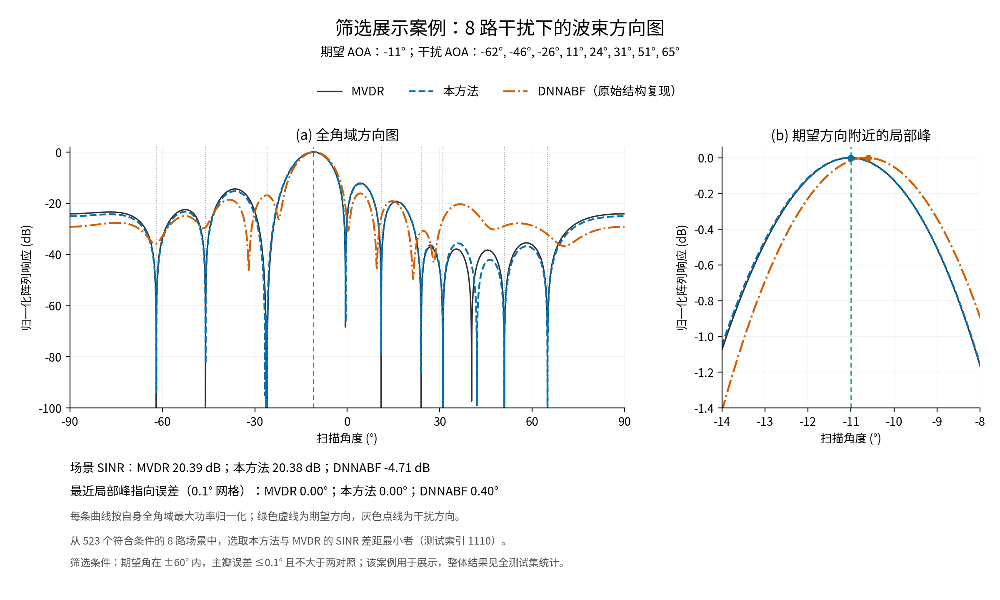

# 基于架构搜索的自适应波束形成网络

本仓库发布本轮完成的 v11 实验：DARTS 搜索的残差全连接网络、训练与架构选择代码、实际使用的数据划分、模型检查点、逐场景评价结果，以及 GPU 推理优化和方向图。网络输入为期望信号与 3–8 路干扰的已知 AOA，输出为 12 元均匀线阵的复数波束形成权值。

当前网络为残差全连接网络，采用物理损失。仓库同时提供 DNNABF 结构对照、固定结构、同结构纯 MSE 和随机结构对照的代码及检查点。所有对照指标和数据筛选条件均随结果发布。

## 下载与环境

二进制数据和模型使用 Git LFS。必须取得实际文件，不能将 LFS 指针当作模型或 NPZ 读取。

```bash
git lfs install
git clone https://github.com/warmjademe/beamform_BestNetwork_BasedOnSearch.git
cd beamform_BestNetwork_BasedOnSearch
git lfs pull
python -m venv .venv
source .venv/bin/activate
python -m pip install -r requirements.txt
```

实际验证环境为 Linux、Python 3.11、PyTorch 2.8.0+cu128、NumPy 1.26.4、Matplotlib 3.10.6、RTX 4090。GPU 推理优化需要可用 CUDA 与 `torch.compile`；绘图使用 Noto Sans CJK JP 字体。CPU 权值预测入口不需要 GPU。默认关闭 TF32，网络使用 FP32，MVDR 和输出相位旋转使用 FP64。

```bash
python verify_release.py --device cuda --out results/release/VALIDATION.json
python predict_restored.py --checkpoint runs/ch3_grid_v11/candidate/retrain/best.pt --angles '9,-68,-54,-22,-15,-7,29,49,77' --device cpu
python predict_ch3_gpu.py --angles '9,-68,-54,-22,-15,-7,29,49,77'
```

`predict_ch3_gpu.py --jsonl requests.jsonl` 支持常驻模型逐条处理多个请求；每行是 `[期望角, 干扰角1, ...]`。CUDA Graph 初始化一次，每次复制新的 AOA/mask 并重新计算权值；内部缓冲不支持并发调用，输出必须在下一次请求前消费或复制。

## 数据与实验条件

数据位于 `data/ch3_grid_good_v11/`，含训练 60000、架构验证 12000、模型选择验证 6000、测试 12000 个场景。每个划分均衡覆盖 3–8 路干扰；按期望角分组划分，四组的期望角不重叠。12 元半波长线阵，SNR=10 dB，每路干扰 INR=30 dB，快拍数 1024，角度网格为 [-90°,90°]、步长 1°。

本次重建约束为期望—干扰间隔至少 7°、任意两路间隔至少 6°；只保留 Oracle MVDR 满足最近局部峰误差 ≤0.5°、平均零陷误差 ≤0.1°、SINR ≥10 dB 的 `good` 场景。该筛选在网络评价之前完成，不按网络结果筛选训练集或测试集。因此结果适用于所声明的条件域，不代表任意 AOA 分布。

NPZ 字段：`angles` 为补齐到 9 维的 AOA，`mask` 为有效方向掩码，`weights` 为样本 MVDR 权值的 24 个实虚分量，`population_weights` 为理论 MVDR 复权值，`quality_*` 为参考算法的筛选指标。`manifest.json` 保存划分、种子、SHA-256 和统计；`audit/` 保存 62 批、507904 个候选场景的接受/拒绝记录。

精确复核应使用随仓库发布且哈希固定的四个 NPZ。`prepare_ch3_grid_v11.py` 是原生成器，其历史去重步骤读取当时工作区的旧场景；那些早期实验未纳入本仓库，不能在清理后的目录直接运行它并期待得到完全相同的数据。筛选审计记录和最终数据已一并发布，不需要重新生成才能训练或评价。

## 搜索与训练

最终网络宽度 384、4 个残差块、2912664 个参数，完整逐层结构在 [ARCHITECTURE.json](results/ch3_grid_v11/ARCHITECTURE.json)。DARTS 搜索 60 轮，离散结构从头训练 320 轮，以独立模型选择验证集的平均 SINR 差距选取检查点。

```bash
python run_ch3_pipeline.py --out runs/reproduced_v11
python run_ch3_completion.py --runs runs/reproduced_v11
```

第一条命令顺序运行搜索、从头重训、固定骨干、同结构纯 MSE、一次随机结构和开发验证；第二条运行原始结构 DNNABF 对照及冻结测试。均使用已发布的数据，不使用测试集选择模型。输出目录必须是新目录。不同设备与软件栈可能产生数值和时间差异，报告中保留实际环境、种子和检查点。

直接重算已发布检查点的完整物理评价：

```bash
python evaluate_ch3_reconstruction.py --out runs/rechecked_test --runs runs/ch3_grid_v11 --split test --strict-run runs/ch3_grid_v11/strict_DNNABF --development-audit runs/ch3_grid_v11/full_development
```

## 独立测试结果

12000 个场景，每个干扰数量 2000 个。主瓣指标采用最接近期望 AOA 的局部峰，并计入边界单侧极大值；它是方向图峰位误差，不是 AOA 估计误差。

| 方法 | 平均 SINR (dB) | 主瓣 MAE (°) | 零陷 MAE (°) |
|---|---:|---:|---:|
| 理论 MVDR | 20.3991 | 0.2182 | 0.0131 |
| 本方法 | 20.1968 | 0.2182 | 0.5807 |
| DNNABF 结构对照 | -2.6278 | 0.3506 | 6.4553 |

全部方法、逐 K 指标、缺失零陷和原始预测见 [FINAL.json](results/ch3_grid_v11/FINAL.json) 与 `runs/ch3_grid_v11/test/`。DNNABF 的零陷均值仅计已匹配方向，其 52 个未匹配方向另有记录。结果支持所选网络的平均 SINR 和主瓣误差接近 MVDR；零陷位置误差较大。随机结构对照的 SINR 略高，当前结果不支持 DARTS 优于随机搜索的精度结论。DNNABF 行表示本仓库所记录配置下的测量结果。

实际干扰方向响应另见 [INTERFERENCE GAIN](results/interference_gain/REPORT.json)。在全部 66000 个干扰方向上，以期望方向响应为 0 dB，本方法的干扰增益中位数为 -71.82 dB，第 95 百分位数为 -56.32 dB，99.30% 的方向达到至少 40 dB 衰减；最差单方向为 -16.58 dB。该统计直接使用真实干扰 AOA，不以最近零陷位置代替；逐方向原始功率比保存在同目录 `per_direction.npz`。

```bash
python evaluate_interference_gain.py --out results/rechecked_interference_gain
```

## GPU 计算时间

`benchmark_ch3_full_test_runtime.py` 在整个测试集上逐条推理（batch=1），保存每个复权值输出，整组计时后除以 12000，重复 5 轮。主比较按实验要求优化本方法，MVDR 与 DNNABF 使用标准实现；额外保留同样进行编译/CUDA Graph 优化的 MVDR 对照。

| 方法 | 全测试集总时间 (s) | 总时间 / 样本数 (ms) |
|---|---:|---:|
| 本方法，原始执行 | 11.8510 | 0.987583 |
| 本方法，融合与 CUDA Graph | **0.5868** | **0.048898** |
| 标准 MVDR | 5.5230 | 0.460250 |
| 标准 DNNABF 前向 | 2.8302 | 0.235847 |
| 优化版 MVDR（补充） | 0.9435 | 0.078622 |

本方法相对标准 MVDR 加速 9.4125 倍，相对 DNNABF 加速 4.8233 倍；这包含部署优化的贡献。主表输入驻留 GPU，不含模型加载、编译、信号采集或 AOA 估计。含 CPU→GPU→CPU 传输时，本方法为 0.075615 ms/场景。整组平均时间与每次同步的独立请求延迟、批量推理吞吐量不同。

优化前后权值最大差 1.075e-7，逐场景 SINR 最大差 3.935e-5 dB，主瓣误差逐场景一致。详细标准差、原始时间和初始化成本见 [REPORT.json](results/ch3_gpu_deployment_v1/REPORT.json)。

```bash
python benchmark_ch3_full_test_runtime.py --out runs/rechecked_runtime
```

## 方向图

保留[首个未筛选的 8 路场景](output/pdf/ch3_latest_pattern/ch3_eight_interferers.pdf)，另提供用户要求的[优势展示案例](output/pdf/ch3_selected_pattern/ch3_selected_eight_interferers.pdf)。后者是按结果选取的有利案例，筛选条件已标注，不能替代整体测试统计。



```bash
python plot_ch3_latest_pattern.py --selection first --out output/pdf/replotted_first
python plot_ch3_latest_pattern.py --selection showcase --out output/pdf/replotted_showcase
```

## 文件说明

- `beamnas/`：模型、搜索模块、损失、指标与推理运行时。
- `run_ch3_*.py`：当前搜索、训练与冻结评价入口。
- `configs/ch3_*.json`：本次实验与计时协议。
- `data/ch3_grid_good_v11/`：实际使用的数据及筛选审计。
- `runs/ch3_grid_v11/`：搜索/训练日志、必要的 `best.pt`、源码快照和逐场景评价。
- `runs/ch3_gpu_deployment_v1/`：推理优化的开发测量与完整测试回归。
- `results/`：汇总结果、架构、验证记录。
- `docs/RELEASE_MANIFEST.json`：发布文件的 SHA-256 与文件大小。

部分辅助文件保留 `original`、`restored` 等历史命名，因为当前流程确实导入它们；不再使用的早期运行入口和原论文 PDF 未进入本发布仓库。源码快照按记录保留；发布不修改原始实验数据或冻结结果。
